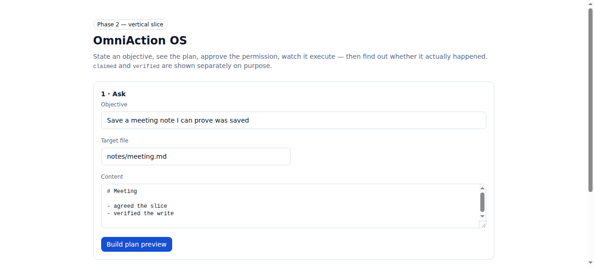
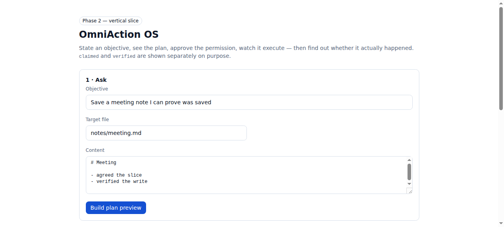
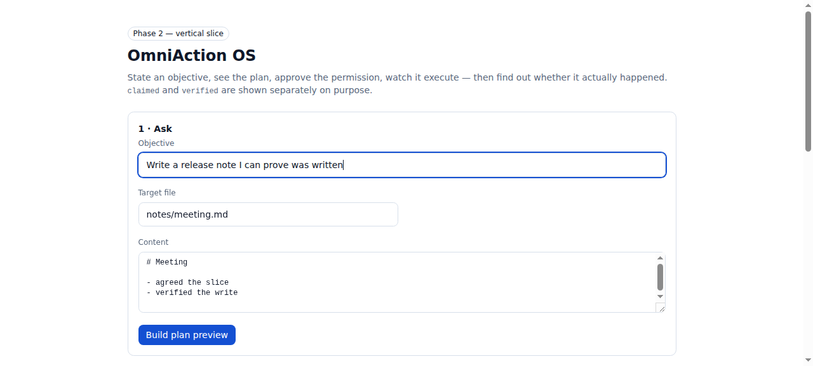

# OmniAction OS

**State an objective, see the plan, approve the permission, watch it execute — then find out whether it actually happened.**

```
connect → ask → plan (dry run) → approve → execute → verify → journal
```

The **verify** step is the one most action platforms skip. An operation
returning `200 OK` is a *claim*. We read external state back to *verify* it,
and the two are stored and displayed as separate facts — never one implying the
other.

---

## What works right now

A complete, verified vertical slice against a real filesystem:

| Step | Status | Evidence |
|---|---|---|
| Connect a source | working | `local-filesystem` connector, sandbox-confined |
| Ask for an objective | working | browser UI + `POST /api/slice` |
| Compile a plan with dry runs | working | irreversibility is named *before* approval |
| Server-side permission gate | working | deny-by-default, justification recorded |
| Execute | working | real file written to disk |
| Independently verify | working | file read back; `claimed` ≠ `verified` |
| Tamper-evident journal | working | SHA-256 chain, 4 entries, verified intact |

Not built: multi-source orchestration, an LLM planner, auth/accounts, durable
storage, the remaining connectors. [Roadmap](#roadmap) below.

### Screenshots

| | |
|---|---|
|  |  |
| **1 · Ask** — the objective | **2 · Preview** — dry run names the irreversible part |
|  | |
| **3 · Result** — claimed vs. independently verified, shown apart | |

---

## Try it

```bash
git clone https://github.com/fsix7115-arch/omni-action-os.git
cd omni-action-os

./scripts/doctor.sh          # check the machine first, read-only
npm install
npm run verify               # typecheck + 27 tests + production build
npm run build && npm start   # then open http://localhost:3000
```

Writes land in `.omni-sandbox/`. Set `OMNI_SANDBOX` to relocate it; every path
is confined to that root and a traversal attempt is refused rather than
silently resolved.

---

## Verification

Everything below was run on this repository, not described:

```
typecheck     clean
tests         27 passed (1 file)
build         ✓ Compiled successfully — 3 routes
doctor        19 passed (python, stdlib only)
```

The 27 tests exercise the real filesystem — nothing is mocked at the I/O
boundary, because a mocked boundary is exactly what would let a broken verifier
pass. Among them:

- a step with no permission is **blocked**, and the file is confirmed absent
- a write that returns success but fails verification reports
  `partially_failed`, **not** success
- the in-band verifier refuses to verify a destructive effect at all
- altering or deleting any journal entry breaks the chain
- `../escape.txt` and `/etc/passwd` are both refused

Live run against `next start`, the journal held four entries —
`execution → permission → verification → verification` — with the chain intact,
and the file existed on disk with the exact bytes written.

---

## Design

Three decisions carry the project:

**Dry run before approval.** Every operation declares whether it supports a dry
run. Steps that cannot be previewed say so in the risk line rather than
appearing harmless.

**Permissions enforced server-side.** The request body carries a justification
for a grant but never a grant. The capsule is minted in the route handler from
that justification. Disabling a button is not access control.

**Verification is mandatory.** An operation with no declared verifier is a
design error. `src/lib/core/verify.ts` includes `RejectsInBandVerifier`, which
compares the provider against itself and is refused for anything destructive —
the anti-pattern is named and tested, not just avoided.

### The honest part

`claimed` and `verified` are separate fields throughout. When a step returns
success but no verifier can confirm it, the run reports `partially_failed` and
`fullyVerified: false`. A 200 is not evidence, and this repository is structured
so that saying otherwise takes more code than saying it.

## Roadmap

Deliberately one verified slice at a time, per the build guide's gates G0–G10.

- [x] **G0–G1** landscape review, design review, environment doctor
- [x] **G2–G5** one connector, one plan, one permission decision, one execution,
      one verification — with the journal
- [ ] **G6** durable storage; plans and journal currently in-memory, so a
      restart clears them
- [ ] **G7** LLM planner that emits plans in this schema
- [ ] **G8** remaining connectors (gmail, github, slack) — each marked
      `unavailable` with its real prerequisite until credentialed
- [ ] **G9** accounts, multi-principal permission capsules
- [ ] **G10** compensation and rollback execution

## Documentation

| File | What it covers |
|---|---|
| [docs/WHY_THIS_PROJECT.md](docs/WHY_THIS_PROJECT.md) | Overlap with OpenHands, Pincer, Kora, ClawSocial, TropaTT; the seven commitments |
| [docs/DECISIONS.md](docs/DECISIONS.md) | Nine ADRs, rejected alternatives, what each choice costs |
| [scripts/doctor.py](scripts/doctor.py) | Read-only environment doctor |
| [CONTRIBUTING.md](CONTRIBUTING.md) | The evidence rule |

## License

MIT — see [LICENSE](LICENSE).